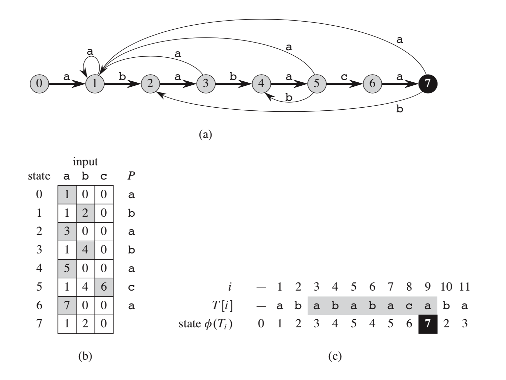
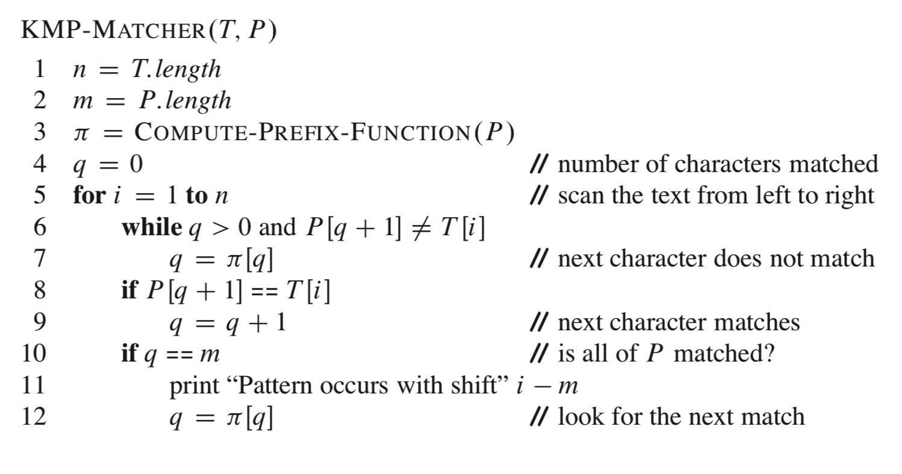
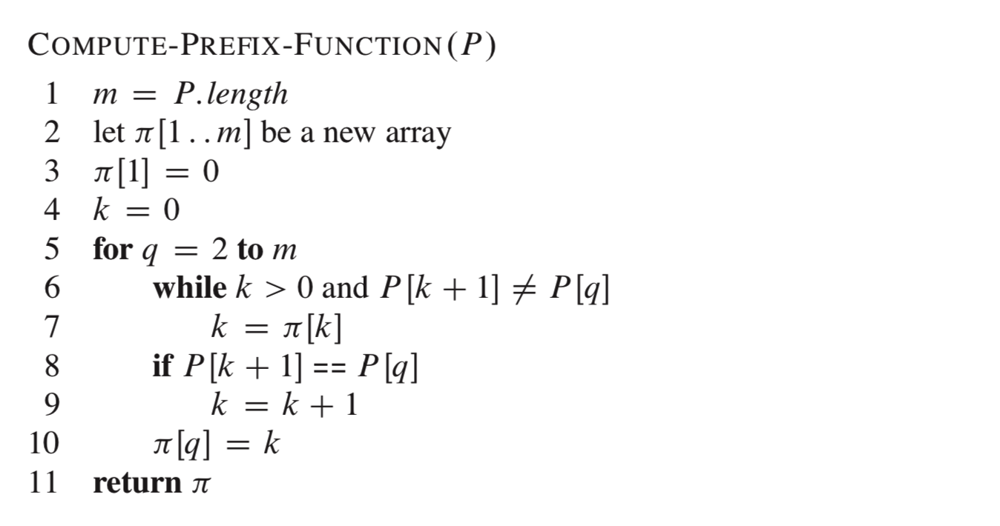
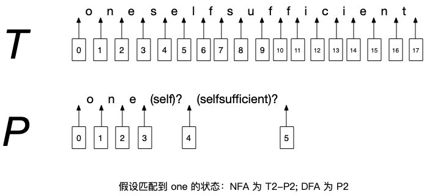
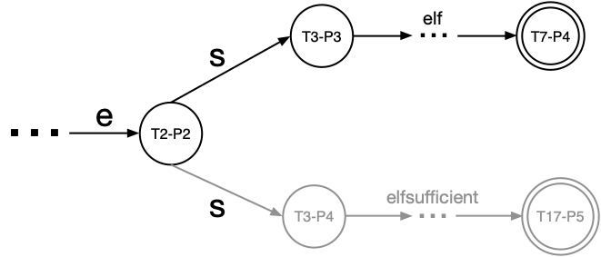
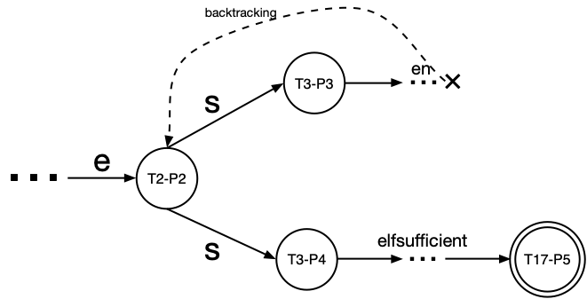
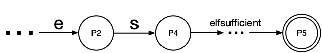

### 1 有限自动机匹配字符串原理

字符串匹配算法这一章的核心就是利用有限自动机匹配字符串。先看一下书中关于有限自动机的定义：

一个 **有限自动机 M** 是一个 5 元组 **(Q, q0, A, ∑, δ)**，其中：

- Q 是所有 **状态** 的有限集合。
- q0 ∈ Q 是 **初始状态**。
- A  Q 是一个特殊的 **接受状态** 集合。
- ∑ 是有限 **输入字母表**。
- δ 是一个从 Q × ∑ → Q 的函数，称为 M 的 **转移函数**。

在基于有限自动机的字符串匹配算法中，给定一个输入串 T 和一个模式串 P（在字符串匹配算法中，T 和 P 都由 ∑ 中的元素组成）：

- 用模式串中字符的索引号表示自动机的状态，于是 Q={0,1,2...m}，其中 q0=0 为初始状态，表示匹配还没开始，m 表示 P 的长度。
- 仅当当前状态为 m 时，这个状态是可接受的，表示匹配成功，即在 T 中找到了一个和 P 相等的子串，即有：A={m}。
- 在匹配过程中，顺序遍历 T，每次从 T 中提取一个字符 a，作为状态转移函数 δ 的一个输入，假设当前状态为 q，T 当前遍历的位置为 i，则一定有： P\[1...q\]=T\[i-q...i-1\]，即 P\[1...q\] 是 T\[1...i-1\] 的后缀。
- 假设 δ(q, a)=q¹，若 q¹=q+1，表示 P\[q+1\]=a，即当前的输入字符就是模式串的下一个字符；若 q¹=q，表示 P\[1...q\]=T\[i-q...i-1\]=T\[i-q+1...i\]，容易证明 P\[1\]=...=P\[q\]，即目前为止，连续比较的字符都是一样的；若 q¹ < q，表示当前模式串 P 需要回溯到左边的位置 q¹+1 和 T\[i+1\] 继续比较，因为已经有 P\[q¹\]=T\[i\] 了；若 q¹=m，处于接受状态，表示一个匹配已经成功了。

自动机的匹配算法过程总结如下：

```
输入 T,δ,m
设当前状态 q=0
顺序遍历 T，当前索引为 i
    q = δ(q, T[i])
    如果 q == m
        记录一个 T 的一个匹配成功的起始位置为 i-m
```

假设 T=abababacaba，P=ababaca，对应的状态转移图、状态转移函数生成的状态转移表以及匹配过程如下图所示：



- 图 (a) 表示状态转移图。
- 图 (b) 表示 δ 基于 ∑ 和 P 生成的所有状态转移表，这里假设 ∑={a,b,c}，某种程度上这张表本身就相当于是自动机 M。
- 图 (c) 表示将 T 作为输入后的匹配过程。

<br>
<br>

### 2 状态转移函数 δ 的实现

状态转移函数 δ 最终要输出一张状态转移表。设定 ∑，对于不同的模式串 P，都需要生成不同的状态转移表。这个叫 **预处理**。书中对于 δ 首先给出了一种直观的方法。

假定当前状态为 q，当前输入为字符 a，下一个状态为 q¹，即 δ(q, a)=q¹，它的含义为：

```
q1 = max{k: P[1]...P[k] 是 P[1]...P[q]a 的后缀} = δ(q, a)
```

所以 δ 的总体计算过程为：针对 ∑ 中的每一个输入字符和当前状态 q，必须找到这样一个最大的 k，P 的前 k 个字符组成的子串刚好是字符串 P\[1\]...P\[q\]a 的后缀。

这种计算 δ 的方式要求预处理 ∑ 的所有元素，所以其时间复杂度受限于 ∑ 的规模以及寻找 k 的方法。

书中随后介绍的 **KMP 算法**，其原理仍然是有限自动机，只不过该算法对 δ 进行了优化，它不再预处理 ∑ 中的所有元素，而是只针对模式串 P 生成一个 P 的前缀函数 π，所以它的时间复杂度只需要依赖于小得多的 P 的规模以及 π 的计算方法。

设当前状态为 q：

```
π[q] = max{k: k < q 且 P[1]...P[k] 是 P[1]...P[q] 的后缀}
```

在匹配过程中，只有当 T 的当前输入字符和 P 的当前匹配字符不相等时，才需要前缀函数 π 来对 P 进行回溯，直到 T 的当前输入字符和前缀函数返回的新的 P 的匹配字符重新匹配为止，然后重复刚才这一过程，直到匹配状态为 m 为止。




<br>
<br>

### 3 有限自动机在正则表达式匹配中的应用

在正则表达式匹配中，必然可以进行普通的字符串匹配，所以正则表达式匹配可以看作是字符串匹配的一个超集。实际上，正则表达式匹配方法的实现正是运用了有限自动机原理，所以也就意味着用有限自动机的思想可以实现普通的字符串匹配。一个正则表达式就相当于字符串匹配中的模式串 P。

实际上，有限自动机分为两种：**非确定有限状态自动机（NFA）** 和 **确定有限状态自动机（DFA）**。正则表达式匹配既可以用 NFA 实现，也可以用 DFA 实现。

不管是 NFA 还是 DFA，其定义和第1节中描述的都是一样的。其不同之处在于：在 NFA 中，转移函数 δ 对相同的输入字符，允许产生一个以上的输出状态；而在 DFA 中，则只会产生一个输出状态。具体到正则表达式匹配上的表现为：

- NFA：NFA 是表达式主导（P主导）的匹配。它依次处理 P 中各个子表达式或组成元素（一个字符或者一个字符组），遇到需要在两个可能成功的可能中进行选择的时候，它会选择其一，同时记住另一个，当选择的那个匹配失败时，会回溯到选择的起点，然后选择记住的另一个进行匹配。在匹配中，输入串 T 会进行回溯。

- DFA：DFA 是文本主导（T主导）的匹配，其扫描的字符串 T 中的每个字符都对引擎进行了控制。在 DFA 中对于有两个可能的选择的情况，会把所有可能的匹配都计算出来，最终只会选择其中的一种，若两个都能匹配成功，则只选择其中最长的匹配。在开始尝试匹配的时候，它已经提前内建了一张路线图（map），描述“遇到这个和这个字符，就该选择这个和那个可能的匹配”。字符串 T 中的每个字符都会按照这张路线图来匹配。这颇类似于上述描述过的字符串匹配算法用到的自动机，路线图相当于状态转移表。在匹配中，输入串 T 是不需要进行回溯的。

我们来看一个例子：假设 T=oneselfsufficient，P=one(self)?(selfsufficient)?，我们对 T 和 P 中字符或字符组的位置进行标注如下：



注意在 P 中，前面的字符 o, n, e 和后面的字符组 (self)? 是属于同一层次的匹配单元。当匹配到 one 中的 e 时，我们假设在 NFA 中的状态为 *```T2-P2```*，在 DFA 中的状态为 *```P2```*，因为 NFA 中的 T 可以回溯，所以它的状态由 T 和 P 的位置同时决定，而 DFA 不需要回溯，所以其状态只与 P 的位置有关。当然这里的状态是假定的，实际的实现可能更为复杂，现在姑且这么假定，用以阐述背后的原理。

现在我们看看 NFA 的状态转移图：



在接下来要输入 s 的时候，有两个状态输出，在 NFA 中把忽略 (self)? 的匹配的分支状态记住（即下面的分支），然后优先匹配 (self)?，匹配成功，后面的 (selfsufficient)? 匹配失败，但是不要紧，因为这个子表达式的匹配允许忽略。在这种情况下，选择一个分支状态可以匹配成功，不需要进行回溯。

再看看需要回溯的情况，这里我们要修改一下正则表达式为 P=one(senf)?(selfsufficient)?，对应的状态转移图为：



在这种情况下，当遇到 s 的时候，同样先记住忽略 (senf)? 匹配的状态分支，但是当匹配 (senf)? 时失败了，这时候 NFA 引擎进行回溯，选择之前记住的分支，并把 T 回溯到之前选择的位置，这样会选择和 (selfsufficient)? 匹配，匹配成功，当然在这里，也会同时记住一条忽略 (selfsufficient)? 匹配的状态分支，图中没有画出来。

如果是在 DFA 中，以上的两条匹配状态分支会提前计算出匹配结果，但是在 NFA 中，只是记住另外一条分支的位置，并不会进行计算。提前计算出来之后，DFA 在多个匹配结果中只选择最长的成功匹配，所以它的状态转移图类似这样：



我们看到，针对接下来的输入 s，DFA 直接选择跟 (selfsufficient)? 进行匹配，而忽略前面的 (self)? 

目前，正则表达式匹配用的比较多的是 NFA，因为 NFA 在实现时不需要维护路线图，所以节省空间，但是其时间复杂度严重依赖于回溯的次数，而回溯的次数又依赖于正则表达式的写法，即 P 是什么样子的。**所以在写正则表达式的时候，如果确定引擎是用 NFA 实现的，必须非常小心，尽量避免不必要的回溯**，在极端情况下，因为正则表达式写法上的区别，可能导致回溯次数相当可观，甚至导致 CPU 占用 100% 的情况。

<br>
<br>
<br>

>算法导论 / 第32章 字符串匹配

